# markoStore 🛍️
### The Ultimate Next.js 15, Tailwind CSS, and Prisma Enterprise E-Commerce Platform

Welcome to **markoStore** — a highly performant, visually stunning, state-of-the-art e-commerce application designed with rich modern design principles. Built using the latest **Next.js 15 App Router**, **React 19**, and **Prisma ORM**, markoStore features a complete user checkout experience, robust administrator control panels, and industry-grade payment solutions powered by **Stripe** and **PayPal**.

---

## 🚀 Key Features

### 🛒 Customer E-Commerce Flow
* **Premium User Experience**: Modern dark/light modes, premium glassmorphic UI elements, and sleek CSS micro-animations.
* **Product Catalog**: Advanced search, filtering by category, pricing, ratings, and instant stock indicators.
* **Interactive Shopping Cart**: Session-persistent cart allowing customers to adjust quantities, remove items, and see instant price breakdowns.
* **Multi-Step Checkout**: Simplified, guided checkout process:
  1. 📍 **Shipping Address** (securely saved to user profiles)
  2. 💳 **Payment Method Selection** (Stripe, PayPal, or Cash on Delivery)
  3. 📝 **Order Placement** (comprehensive summary of pricing, taxes, shipping fees, and items)
* **Secure E-Payments**: Full integration with **Stripe Checkout Elements** and **PayPal Sandbox SDK**.
* **Personalized Dashboard**: View personal profile details, edit addresses, and track real-time order history.

### 🛡️ Administrator Operations Center
* **Analytical Dashboard**: Overview panels showcasing total sales, sales trends charts, total registered users, order volume, and a list of recent transactions.
* **Product Management (CRUD)**: Create, read, update, and delete products, set stock values, upload multiple images, and set banner highlights.
* **Order Management**: Monitor all customer transactions, track payment success, update shipping/delivery states (e.g., mark as Delivered).
* **User Accounts Controller**: View all user accounts, assign or modify roles (`user`, `admin`).

---

## 🛠️ Technical Stack & Architecture

| Layer | Technology | Key Capabilities |
| :--- | :--- | :--- |
| **Framework** | Next.js 15.5.3 (App Router) | Server-Side Rendering (SSR), Server Actions, Dynamic Streaming |
| **Library** | React 19 / ReactDOM 19 | UseActionState hooks, concurrent transition states |
| **Styling** | Tailwind CSS v4 & Shadcn UI | Harmonious color palette, glassmorphism, responsive UI |
| **ORM** | Prisma 6.16.2 | Direct driver adapters for serverless environments |
| **Database** | Neon PostgreSQL (Serverless) | Fast, cloud-scale relational storage |
| **Authentication**| NextAuth.js v5 (Beta 29) | Edge-compatible NextAuth, session management, secure Bcrypt |
| **Payments** | Stripe & PayPal | Secure client elements, transactional webhooks, and sandbox APIs |
| **Media Uploads** | UploadThing | Serverless, highly-secure file uploads for product/banner images |
| **Emails** | Resend & React Email | Beautiful transactional email templates |

---

## 💳 Stripe E-Payment Deep Dive

markoStore employs a highly secure, modern architecture to process credit card payments via **Stripe**. This implementation eliminates sensitive billing data from passing through our servers, relying instead on tokenized Stripe payloads.

### 🔄 The E-Payment Payment Flow

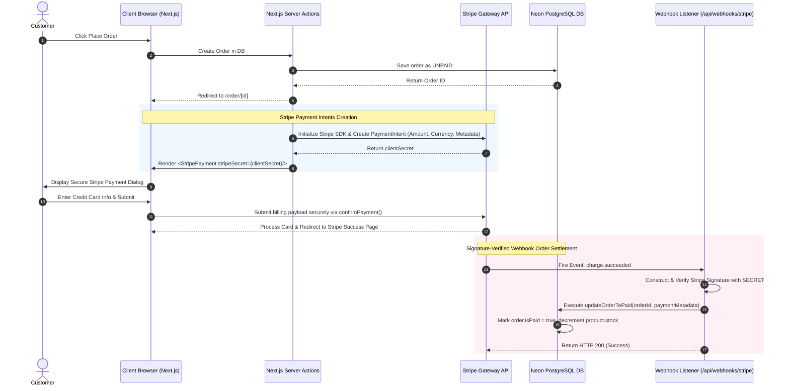

### 🧑‍💻 Technical Code Integration Highlights

#### 1. Server-Side Payment Intent Creation (`app/(root)/order/[id]/page.tsx`)
When a customer lands on the order details page and selected "Stripe", Next.js initializes a Stripe instance and requests a `PaymentIntent`:
```typescript
import Stripe from 'stripe';

if (order.paymentsMethod === 'Stripe' && !order.isPaid) {
  const stripe = new Stripe(process.env.STRIPE_SECRET_KEY as string);
  const paymentIntents = await stripe.paymentIntents.create({
    amount: Math.round(Number(order.totalPrice) * 100), // Stripe expects cents
    currency: 'USD',
    metadata: { orderId: order.id }
  });
  
  // paymentIntents.client_secret is passed down to the client component
}
```

#### 2. Client-Side Stripe Elements Form (`app/(root)/order/[id]/StripePayment.tsx`)
On the client side, we load Stripe's SDK and inject the `clientSecret` into the `<Elements>` context provider, rendering secure inputs:
```typescript
import { loadStripe } from "@stripe/stripe-js";
import { Elements, PaymentElement, useStripe, useElements } from "@stripe/react-stripe-js";

const stripePromise = loadStripe(process.env.NEXT_PUBLIC_STRIPE_PUBLISHABLE_KEY!);

const StripeForm = () => {
  const stripe = useStripe();
  const elements = useElements();

  const handleSubmit = async (e) => {
    e.preventDefault();
    if (!stripe || !elements) return;

    await stripe.confirmPayment({
      elements,
      confirmParams: {
        return_url: `${APP_URL}/order/${orderId}/stripe-payment-success`,
      },
    });
  };

  return (
    <form onSubmit={handleSubmit}>
      <PaymentElement />
      <button disabled={!stripe}>Pay with Credit Card</button>
    </form>
  );
};
```

#### 3. Secure Webhook Settlement Listener (`app/api/webhooks/stripe/route.ts`)
To protect against payment manipulation, order status updates only occur when a cryptographically verified webhook event is received directly from Stripe's network:
```typescript
import { updateOrderToPaid } from "@/lib/actions/order.action";
import Stripe from "stripe";

export async function POST(request: NextRequest) {
  const body = await request.text();
  const signature = request.headers.get("Stripe-Signature") as string;

  let event;
  try {
    event = Stripe.webhooks.constructEvent(
      body,
      signature,
      process.env.STRIPE_WEBHOOK_SECRET as string
    );
  } catch (err) {
    return NextResponse.json({ message: "Signature verification failed" }, { status: 400 });
  }

  if (event.type === "charge.succeeded") {
    await updateOrderToPaid({
      orderId: event.data.object.metadata.order_id,
      paymentResult: {
        id: event.data.object.id,
        status: 'COMPLETED',
        email_address: event.data.object.billing_details.email!,
        pricePaid: String((event.data.object.amount / 100).toFixed(2))
      }
    });
    return NextResponse.json({ message: "Payment recorded successfully" }, { status: 200 });
  }
}
```

---

## ⚙️ Environment Variables Configuration

To run **markoStore** locally or in production, create a `.env` file in the root directory. Copy the structure below and configure the keys:

```env
# APP GENERAL CONFIGURATION
NEXT_PUBLIC_APP_NAME="markoStore"
NEXT_PUBLIC_DESCRIPTION="A premium e-commerce platform built with Next.js 15"
NEXT_PUBLIC_APP_URL="http://localhost:3000"

# DATABASE (Neon Serverless PostgreSQL URL)
DATABASE_URL="postgresql://<user>:<password>@<host>/<dbname>?sslmode=require"

# NEXT AUTH (Authentication Configuration)
NEXTAUTH_SECRET="your_next_auth_secret_key"
NEXTAUTH_URL="http://localhost:3000"
NEXTAUTH_URL_INTERNAL="http://localhost:3000"

# PAYMENT SETTINGS
PAYMENT_METHODS="PayPal, Stripe, CashOnDelivery"
DEFAULT_PAYMENT_METHOD="Stripe"

# PAYPAL API CREDENTIALS
PAYPAL_API_URL="https://api-m.sandbox.paypal.com"
PAYPAL_CLIENT_ID="your_paypal_sandbox_client_id"
PAYPAL_APP_SECRET="your_paypal_sandbox_app_secret"

# STRIPE API CREDENTIALS (e-Payment)
NEXT_PUBLIC_STRIPE_PUBLISHABLE_KEY="pk_test_..."
STRIPE_SECRET_KEY="sk_test_..."
STRIPE_WEBHOOK_SECRET="whsec_..."

# UPLOADTHING (Media Uploads)
UPLOADTHING_TOKEN="your_uploadthing_token"
UPLOADTHING_SK="your_uploadthing_secret_key"
UPLOADTHING_APP_ID="your_uploadthing_app_id"

# RESEND (Transactional Email)
RESEND_API_KEY="re_..."
SENDER_EMAIL="onboarding@resend.dev"
```

---

## 🏃 Local Setup Guide

Follow these simple instructions to install dependencies, generate client files, and launch the developer server locally:

### 1. Clone & Install Dependencies
```bash
npm install
```

### 2. Generate Prisma Client
```bash
npx prisma generate
```

### 3. Start Development Server
```bash
npm run dev
```
Open [http://localhost:3000](http://localhost:3000) inside your web browser.

---

## 🖼️ Application Visual Walkthrough

Below are actual high-resolution screenshots illustrating the comprehensive shopping experience, Stripe checkout panels, and admin control panels.

### 🛍️ Client & Buyer Experience

#### 1. Elegant Homepage
Premium store interface with featured product carousels, detailed product grids, and sleek responsive layout.
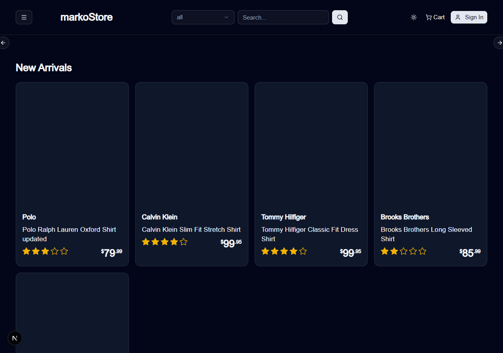

#### 2. Detailed Product Page
Interactive views featuring stock gauges, multi-image product carousels, star rating cards, and dynamic "Add to Cart" triggers.
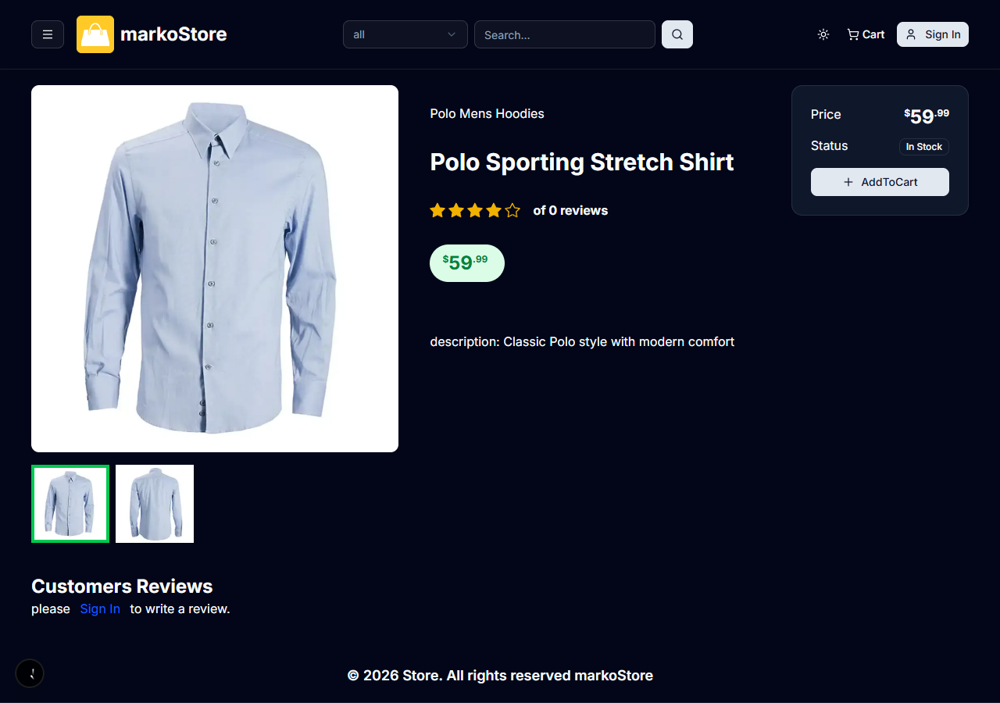

#### 3. Shopping Cart Interface
Check item breakdowns, modify order quantities, and view real-time tax and delivery charge updates.
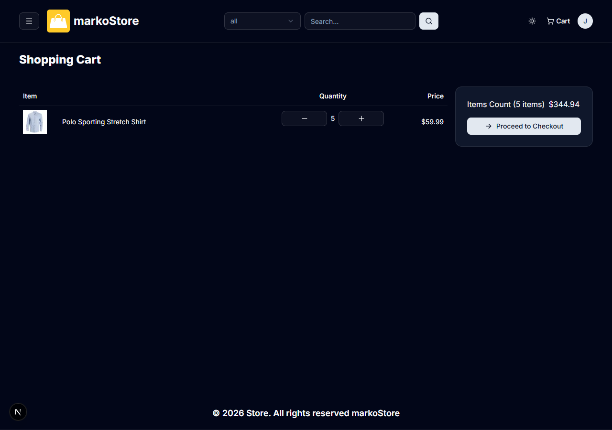

#### 4. Authentication Portal
Secure Sign-In and Sign-Up flows backed by NextAuth.js to safeguard buyer session credentials.
<table>
  <tr>
    <td><b>Secure Sign In</b></td>
    <td><b>Create Account</b></td>
  </tr>
  <tr>
    <td>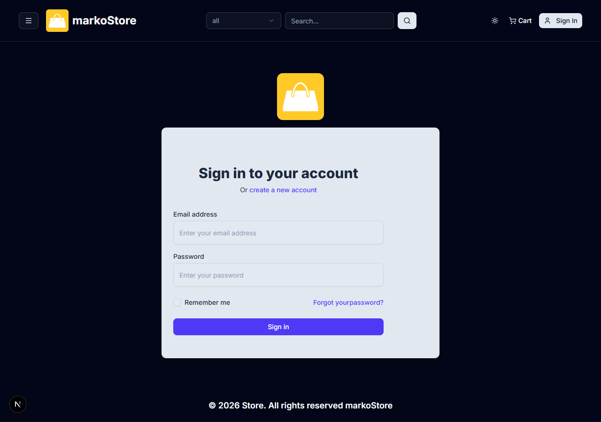</td>
    <td>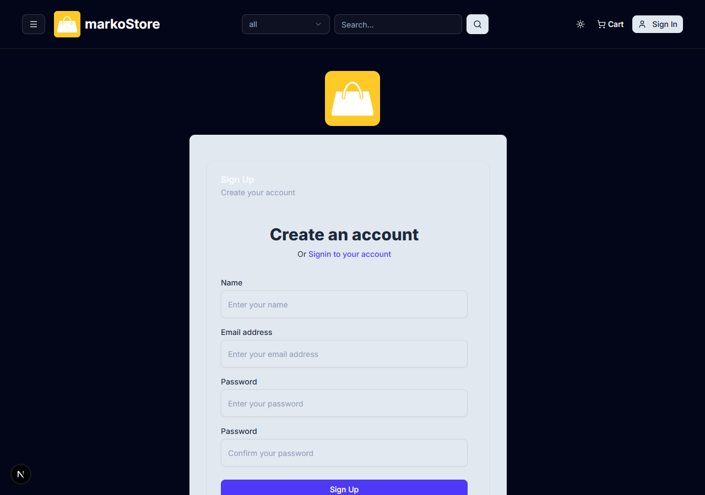</td>
  </tr>
</table>

---

### 💳 Guided Multi-Step Checkout Flow

#### 1. Shipping Destination Details
Enter delivery metadata, securely recorded to user accounts for seamless repeat business.
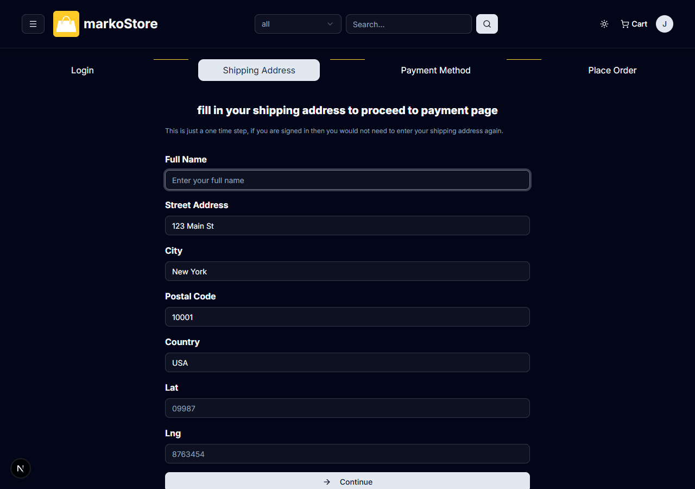

#### 2. Payment Method Selector
Choose Cash on Delivery, PayPal, or credit card billing via **Stripe**.
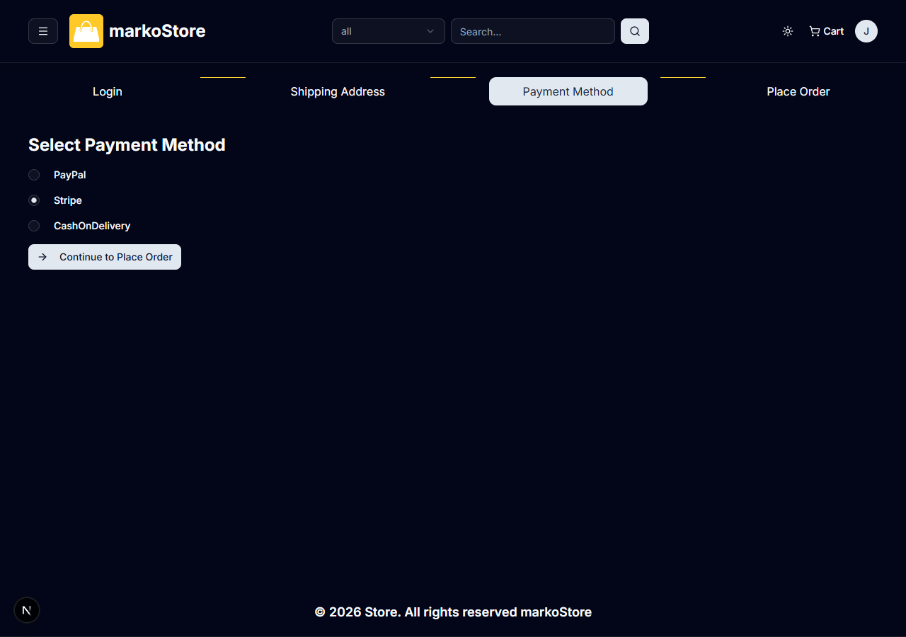

#### 3. Place Order Summary
A final check on items, delivery address, tax pricing, and shipping logistics prior to billing.
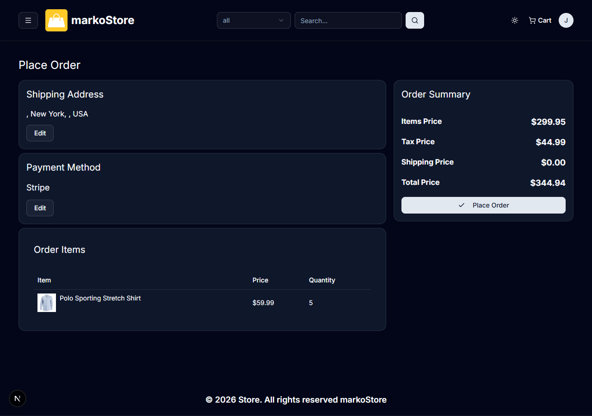

#### 4. Secure Stripe Payment Elements Dialog
Embedded Stripe payment framework processing credit cards securely, rendering custom layouts, and triggering validation checks on the fly.


---

### 👤 Customer Account Controls

#### 1. Personal Profile Panel
Keep your contact information, credentials, and settings up to date.
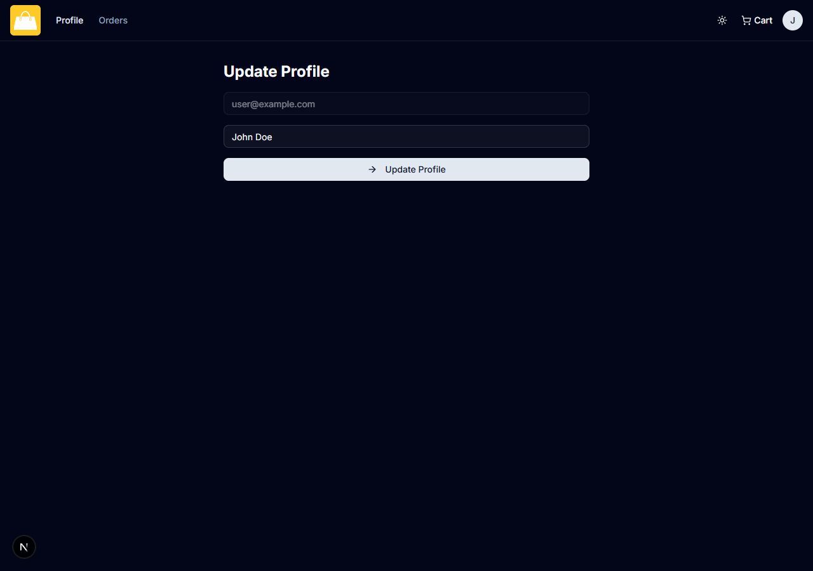

#### 2. Personal Orders History
View past transaction invoices, check delivery statuses, and track fulfillment records.
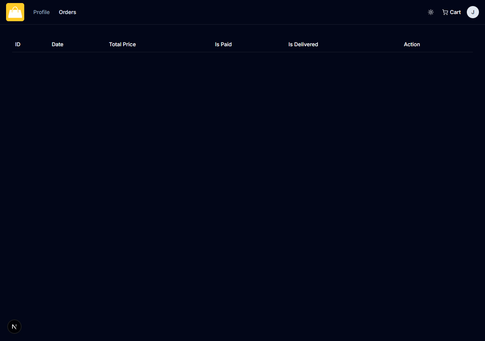

---

### 📊 Admin Operations Center

#### 1. Analytical Dashboard Panel
Real-time operations dashboard presenting sales trend metrics, customer counts, inventory statistics, and recent orders.
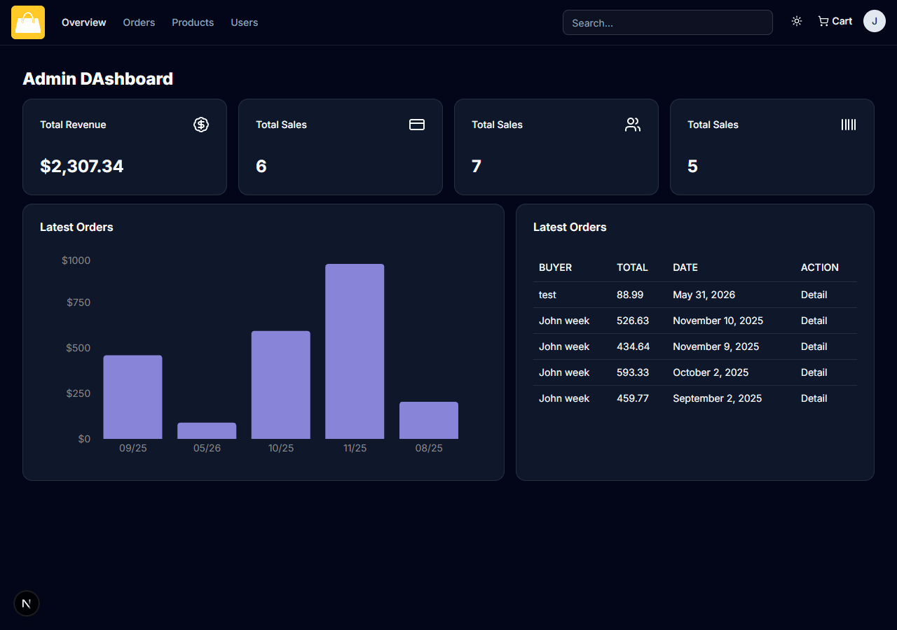

#### 2. Products Inventory Controller
Perform standard CRUD actions: edit prices, update stocks, customize tags, or delete products.
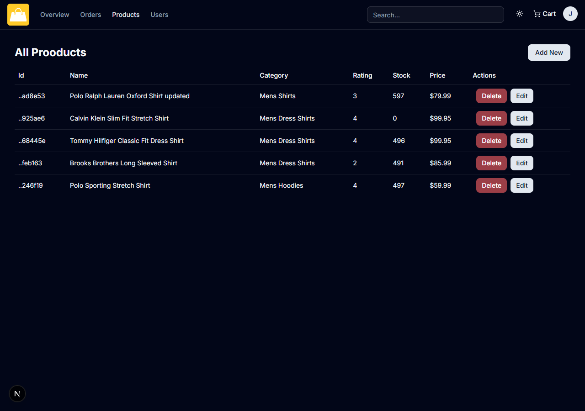

#### 3. Master Orders Registry
Trace payments, manage statuses, and fulfill user deliveries across all customer transactions.
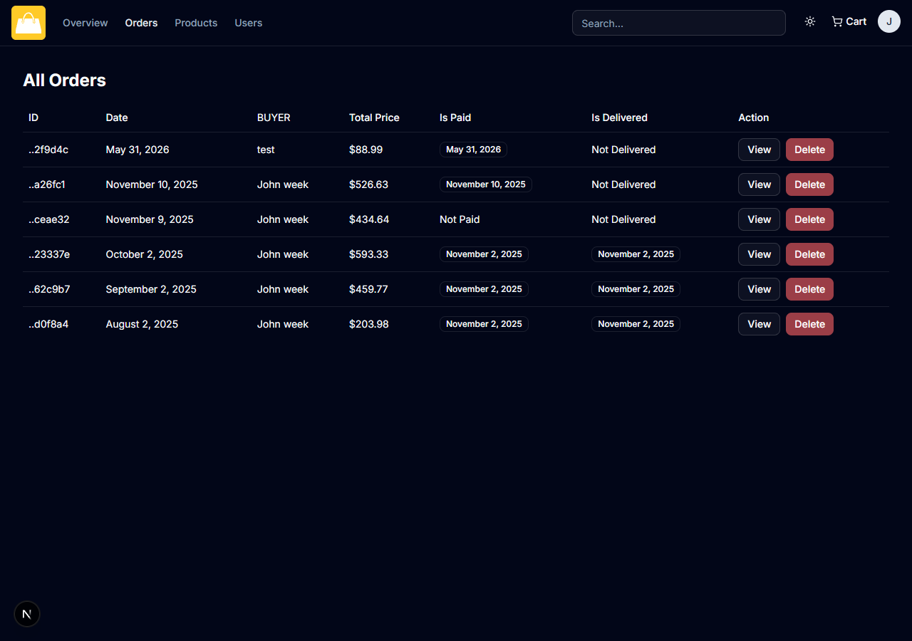

#### 4. User Accounts Controller
Monitor registered users, inspect credentials, and manage roles to secure internal administration.
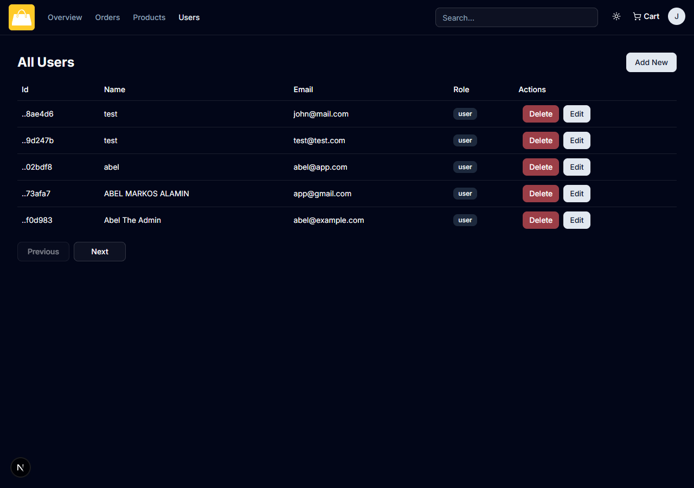

---

Developed with ❤️ using Next.js 15, Tailwind CSS, and Prisma.
